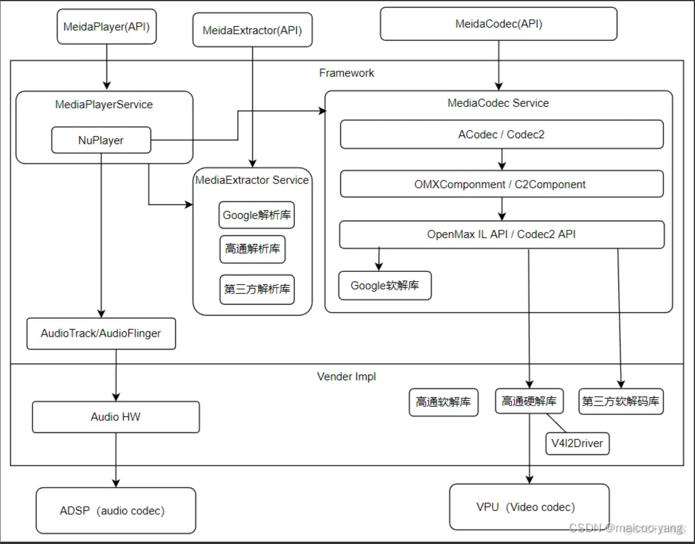
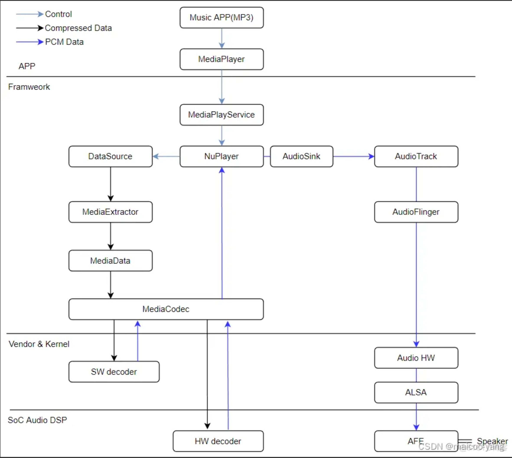
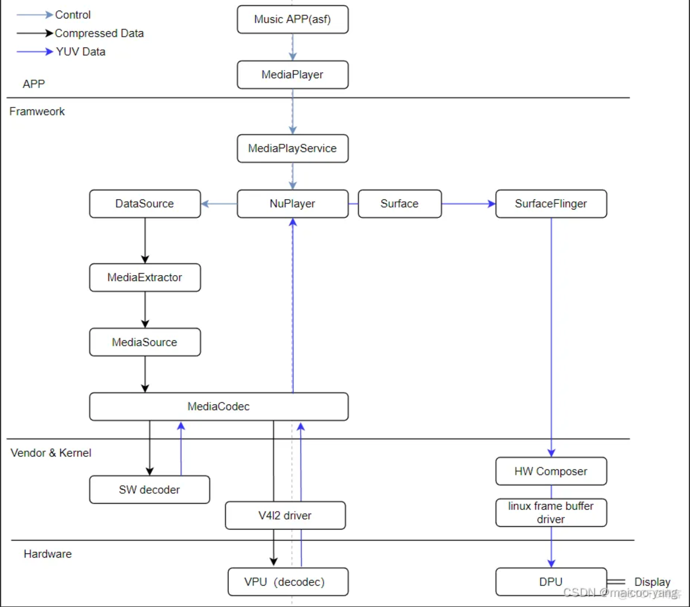

## Android Q 播放器架构

Android 10 之后引入专用的 C2 架构（用来代理 OMX IL 架构），C2 相比 OMX 更加灵活，支持更多功能。

- NuPlayerDriver
  NuPlayerDriver 是对 NuPlayer 的封装，继承 MediaPlayerInterface 接口。通过 NuPlayer 来实现播放的功能。看这部分代码的方法就是先看 NuPlayerDriver 里面干了啥，转头就去找 NuPlayer 里面的实现，一般都要再去 NuPlayer 的 onMessageReceive 中看消息的响应，最后回到 NuPlayerDriver 的各种 notify 中看流程的周转。

- AVNuFactory
  负责关键组件的创建，包括 decoder，renderer，通过它能看到数据流从 Source-Decoder-Renderer，中间由 AMessages 驱动。

- Source
  表示数据源，同时里面包含解析模块 MediaExtractor，功能类似 FFmpeg 的 avformat，并且 Source 继承自 AHandler，同样拥有发送/处理消息的能力。

  - GenericSource：表示本地数据源
  - HTTPLiveSource：表示网络数据源
  - 其他

- Decoder
  解码器，功能类似 FFmpeg 的 avcodec，封装了用于 AVC、AAC 解码的接口，通过 ACodec 实现解码（包含 OMX 硬解码和软解码），它的初始化在 NuPlayer::onMessageReceived()方法中。

- Renderer
  渲染器，功能类似声卡驱动和显卡驱动，主要用于音视频渲染和同步，与 NativeWindow 有关，创建过程在 NuPlayer::onStart()中

#### 解码数据流向

1. 音乐 APP 调用 MediaPlayer 接口播放音乐，并将原始音乐文件的 fd 传给 MediaPlayService
2. MediaPlayService 调用 NuPlayer，NuPlayer 使用 MediaExtractor 对该文件进行解析，识别音轨，歌曲信息，播放时长等。
3. NuPlayer 使用 MediaExtractor 提取数据，将数据送给 MediaCodec 的 Input Buffer。
4. MediaCodec 使用软解码 SW decoder，最终解码后是 PCM 数据，放到 Output Buffer。
5. NuPlayer 从 Output Buffer 取数据，再通过 AudioTrack 将音频数据送给 AudioFlinger。
6. AudioFlinger 再通过 ALSA 驱动写到 DSP，DSP 处理后转成模拟信号播放出来。
   

#### 视频解码流向

1. 视频 APP 调用 MediaPlayer 接口播放视频，并将原始视频文件的 fd 传给 MediaPlayService。
2. MediaPlayService 调用 NuPlayer，NuPlayer 使用 MediaExtractor 对该文件进行解析，识别音轨，歌曲信息，播放时长等。
3. NuPlayer 使用 MediaExtractor 提取数据，将数据送给 MediaCodec 的 Input Buffer。
4. MediaCodec 使用软解码 SW decoder 或硬解码 VPU 解码，最终解码后是 YUV 数据，放到 Output Buffer。
5. NuPlayer 从 Output Buffer 取数据，再通过 Surface 将音频数据送给 SurfaceFlinger。
6. SurfaceFlinger 再通过 HW Composer 将数据推送到 DPU 进行渲染，之后再推到屏幕显示。
   

   - MediaExtractor 负责从文件中分离音视频数据，并抽象成 MediaSource。
   - MediaSource 生产数据，送往 MediaCodec。MediaCodec 又将数据通过 ACodec 和 OMX 的接口送往 Decoder。
   - Decoder 解码后的数据会返回给 MediaCodec，之后再由 MediaCodec 送往 Renderer 模块。
   - MediaExtractor 以 plugin 的方式支持不同的音视频格式

#### 参考资料

- [《Android MediaPlayer 源码分析》](https://blog.csdn.net/u013936727/article/details/127871783) NuPlayer 的创建
- [《MediaPlayer 的核心-NuPlayer》](https://juejin.cn/post/7187980308892319799)
- [《NuPlayer 解封装模块分析](https://blog.csdn.net/qq_25333681/article/details/90614193)
- [《MediaExtractor 源码分析一》](https://blog.csdn.net/mdx20072419/article/details/125182794)
- [《MediaExtractor 源码分析二》](https://blog.csdn.net/mdx20072419/article/details/125189651)
