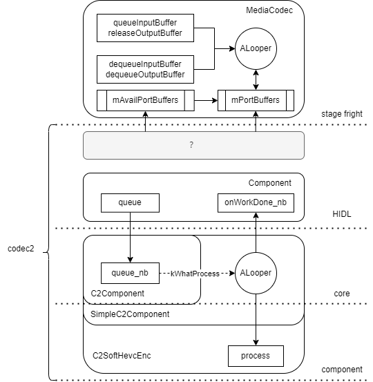

## Android Codec2处理流程适配和解析


### 1. 介绍
Codec2是Android中多媒体相关的软件框架，是MediaCodec的中间件，往上对接MediaCodec Native层，往下提供新的API标准供芯片底层的编解码去实现，也就是说适配了Codec2，就可以通过MediaCodec来调用芯片的硬件编解码的能力，来完成一些多媒体相关的功能。

### 2. 目录结构

Android中的codec2目录在frameworks/av/media/codec2
```shell
.
├── Android.mk
├── components     # 适配的组件，如h264、hevc软件编解码等，由HIDL调用
├── core           # codec2内核，对接component, 组织了components的运行方式
├── docs
├── faultinjection
├── fuzzer
├── hidl           # hal层实现
├── OWNERS
├── sfplugin       # 和stagefright的对接层
├── TEST_MAPPING
├── tests
└── vndk
```
#### 2.1 C2Component
```cpp
class C2Component {
public:
    class Listener {
    public:
        // 当一帧数据处理完了之后会回调该接口
        virtual void onWorkDone_nb(std::weak_ptr<C2Component> component,
                                std::list<std::unique_ptr<C2Work>> workItems) = 0;
        virtual void onTripped_nb(std::weak_ptr<C2Component> component,
                               std::vector<std::shared_ptr<C2SettingResult>> settingResult) = 0;
        virtual void onError_nb(std::weak_ptr<C2Component> component,
                             uint32_t errorCode) = 0;
        virtual ~Listener() = default;
    };

    ...
    /* Queues up work for the component. */
    // 可以看作送帧/送流的接口，在编解码之前，将需要处理的原始数据送入，该接口必现设计为非阻塞的
    virtual c2_status_t queue_nb(std::list<std::unique_ptr<C2Work>>* const items) = 0;
    /*
     * Announces a work to be queued later for the component. This reserves a slot for the queue
     * to ensure correct work ordering even if the work is queued later.
     */
    virtual c2_status_t announce_nb(const std::vector<C2WorkOutline> &items) = 0;

    enum flush_mode_t : uint32_t {
        /// flush work from this component only
        FLUSH_COMPONENT,

        /// flush work from this component and all components connected downstream from it via
        /// tunneling
        FLUSH_CHAIN = (1 << 16),
    };

    /*
     * Discards and abandons any pending work for the component, and optionally any component
     * downstream.
     */
    virtual c2_status_t flush_sm(flush_mode_t mode, std::list<std::unique_ptr<C2Work>>* const flushedWork) = 0;

    enum drain_mode_t : uint32_t {
        DRAIN_COMPONENT_WITH_EOS,
        DRAIN_COMPONENT_NO_EOS = (1 << 0),
        DRAIN_CHAIN = (1 << 16),
    };

    /*
     * Drains the component, and optionally downstream components. This is a signalling method;
     * as such it does not wait for any work completion.
     * Marks last work item as "drain-till-here", so component is notified not to wait for further
     * work before it processes work already queued. This method can also used to set the
     * end-of-stream flag after work has been queued. Client can continue to queue further work
     * immediately after this method returns.
     */
    virtual c2_status_t drain_nb(drain_mode_t mode) = 0;

    // STATE CHANGE METHODS
    // =============================================================================================
    virtual c2_status_t start() = 0;
    virtual c2_status_t stop() = 0;
    virtual c2_status_t reset() = 0;
    virtual c2_status_t release() = 0;
    virtual std::shared_ptr<C2ComponentInterface> intf() = 0;

    virtual ~C2Component() = default;
};
```

#### 2.2 SimpleC2Component
SimpleC2Component提供了一种组件的实现，后面不同的实现只需要继承该实现即可，其中重要的接口设计如下
```cpp
class SimpleC2Component
        : public C2Component, public std::enable_shared_from_this<SimpleC2Component> {
public:
    explicit SimpleC2Component(
            const std::shared_ptr<C2ComponentInterface> &intf);
    virtual ~SimpleC2Component();

    // 设置对应的回调
    virtual c2_status_t setListener_vb(
            const std::shared_ptr<Listener> &listener, c2_blocking_t mayBlock) override;
    // 实现queue_nb接口
    // 该函数实现了C2Component.queue_nb，实际只是将work放到队列中，并且发起一个异步消息然后返回，满足非阻塞的要求
    virtual c2_status_t queue_nb(std::list<std::unique_ptr<C2Work>>* const items) override;
    ...
    // 实际处理一帧数据的函数
    bool processQueue();

protected:
    ...
    // 具体的编解码过程，由子类实现
    virtual void process(
            const std::unique_ptr<C2Work> &work,
            const std::shared_ptr<C2BlockPool> &pool) = 0;
    ...

    private:
    const std::shared_ptr<C2ComponentInterface> mIntf;

    class WorkHandler : public AHandler {
    public:
        ...

    protected:
        // 异步消息处理接口
        // 异步消息处理接口，当发出对应的消息时最终会调用到该函数中
        void onMessageReceived(const sp<AMessage> &msg) override;

    private:
        ...
    };
    ...
    struct ExecState {
        ExecState() : mState(UNINITIALIZED) {}

        int mState;
        std::shared_ptr<C2Component::Listener> mListener;
    };
    // 状态机
    Mutexed<ExecState> mExecState;

    sp<ALooper> mLooper;
    sp<WorkHandler> mHandler;

    class WorkQueue {
        ...
    }
    // 待处理的工作队列
    Mutexed<WorkQueue> mWorkQueue;
    ...
```

#### 2.3 processQueue
函数完成编解码的实际操作，代码如下，其中process和onWorkDone_nb都由子类实现，work先从之前的mWorkQueue队列中拿出，再调用process进行处理，process是一个虚函数，由子类实现，处理完成之后再调用listener->onWorkDone_nb通知处理完成事件onWorkDone_nb也是一个虚函数，由子类实现。
```cpp
bool SimpleC2Component::processQueue() {
    ...
    bool hasQueuedWork = false;

    {
        Mutexed<WorkQueue>::Locked queue(mWorkQueue);
        if (queue->empty()) {
            return false;
        }

        ...
        work = queue->pop_front();
        hasQueuedWork = !queue->empty();
    }

    if (!mOutputBlockPool) {
        c2_status_t err = [this] {
            ...
            std::shared_ptr<C2BlockPool> blockPool;
            err = GetCodec2BlockPool(poolId, shared_from_this(), &blockPool);
            ALOGD("Using output block pool with poolID %llu => got %llu - %d",
                    (unsigned long long)poolId,
                    (unsigned long long)(
                            blockPool ? blockPool->getLocalId() : 111000111),
                    err);
            if (err == C2_OK) {
                // mOutputBlockPool作用是什么？
                mOutputBlockPool = std::make_shared<BlockingBlockPool>(blockPool);
            }
            return err;
        }();
        ...
    }

    ...
    process(work, mOutputBlockPool);
    ...
    // 查看工作链中已处理完的数量，其实就是看proess是否处理成功？
    if (work->workletsProcessed != 0u) {
        queue.unlock();
        Mutexed<ExecState>::Locked state(mExecState);
        ALOGV("returning this work");
        std::shared_ptr<C2Component::Listener> listener = state->mListener;
        state.unlock();
        listener->onWorkDone_nb(shared_from_this(), vec(work));
    } else {
        ...
    }

    return hasQueuedWork;
}
```
### codec2数据流
