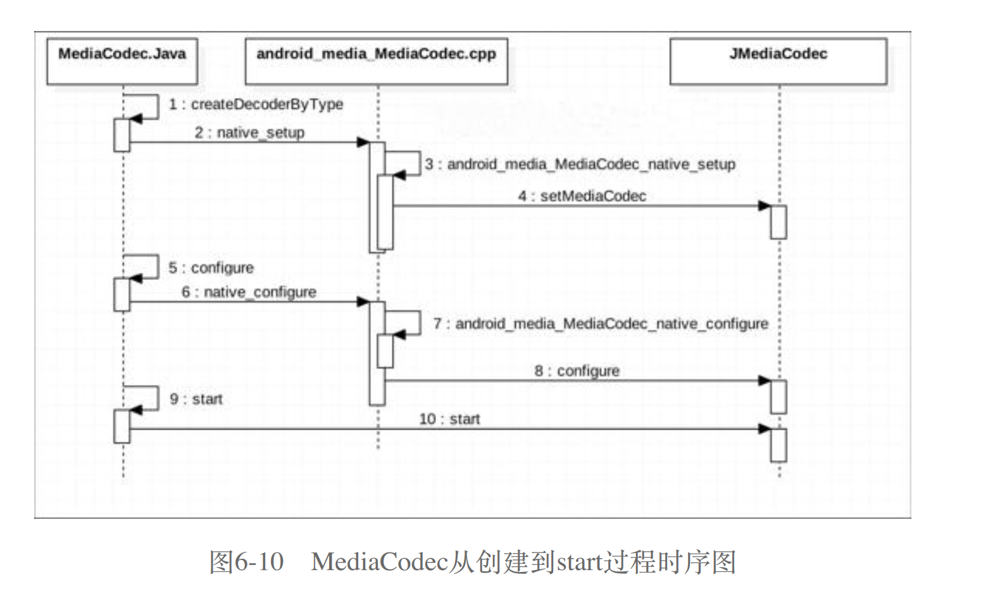

## MediaCodec 介绍

### 创建 MediaCodec 的⽅式

- 按格式创建 MediaCodec

  ```java
  // 创建解码器
  MediaCodec mediaCodec = MediaCodec.createDecoderByType("video/avc");

  // 创建编码器
  MediaCodec mediaCodec = MediaCodec.createEncoderByType("video/avc");
  ```

- 按 Codec 名字创建 MediaCodec

  ```java
  // OMX.google.h264.decoder：软解码
  // OMX.qcom.video.decoder.avc：硬解码
  MediaCodec createByCodecName(String name)
  ```

#### MediaCodec 创建到 start 的流程
  

#### 系统

系统中可以存在很多解码器 ， 但能够被应⽤的解码器是根据配置来的,即/system/etc/media_codecs.xml。这个⽂件⼀般由硬件或者系统的⽣产⼚家在编译整个系统的时候提供，⼀般保存在代码的 device/[company]/[codename]⽬录下。


#### 创建提取器
+ 添加适用于新格式的提取器时，请确保提取器仅依赖于稳定的 NDK API，而不依赖于任何私有 API。
+ 提取器应该实现由 frameworks/av/include/media/MediaExtractorPluginApi.h 定义的 API，且可以使用 frameworks/av/include/media/MediaExtractorPluginHelper.h 中的 C++ 便捷封装容器。
  ```C++
  // extractor plugins can derive from this class which looks remarkably
  // like MediaExtractor and can be easily wrapped in the required C API
  class MediaExtractorPluginHelper
  {
  public:
      virtual ~MediaExtractorPluginHelper() {}
      virtual size_t countTracks() = 0;
      virtual MediaTrackHelper *getTrack(size_t index) = 0; 

      enum GetTrackMetaDataFlags {
          kIncludeExtensiveMetaData = 1
      };
      virtual media_status_t getTrackMetaData(
              AMediaFormat *meta,
              size_t index, uint32_t flags = 0) = 0;  

      // Return container specific meta-data. The default implementation
      // returns an empty metadata object.
      virtual media_status_t getMetaData(AMediaFormat *meta) = 0; 

      enum Flags {
          CAN_SEEK_BACKWARD  = 1,  // the "seek 10secs back button"
          CAN_SEEK_FORWARD   = 2,  // the "seek 10secs forward button"
          CAN_PAUSE          = 4,
          CAN_SEEK           = 8,  // the "seek bar"
      };  

      // If subclasses do _not_ override this, the default is
      // CAN_SEEK_BACKWARD | CAN_SEEK_FORWARD | CAN_SEEK | CAN_PAUSE
      virtual uint32_t flags() const {
          return CAN_SEEK_BACKWARD | CAN_SEEK_FORWARD | CAN_SEEK | CAN_PAUSE;
      };

    virtual media_status_t setMediaCas(const uint8_t* /*casToken*/, size_t /*size*/) {
        return AMEDIA_ERROR_INVALID_OPERATION;
    }

    virtual const char * name() { return "<unspecified>"; }

  protected:
      MediaExtractorPluginHelper() {}

  private:
      MediaExtractorPluginHelper(const MediaExtractorPluginHelper &);
      MediaExtractorPluginHelper &operator=(const MediaExtractorPluginHelper &);
  };
  ```
+ 系统已有的实现frameworks/av/media/extractors中找到,实现MediaExtractorPluginHelper即可
  ```C++
  class WAVExtractor : public MediaExtractorPluginHelper 
  ```
+ 由于 Android 10 或更高版本仅支持提取器 API 的最高版本，因此请务必先将提取器 API 升级到最高版本，然后再对提取器进行建模。

+ 将自定义提取器放在 /system/lib/64/extractors 或供应商 APEX 中，后者会随包含 Google 提取器的 Google APEX 一起打开。如需验证相应框架是否已加载您的提取器，请运行以下命令。
  ```shell  
  adb shell dumpsys media.extractor 
  ```


#### 创建自定义解码器
对于 Google 提供的解码器尚不支持的格式，您都需要创建一个自定义解码器。已经支持的格式实现在frameworks/av/media/codec2/components。

#### 参考资料

- [《自定义媒体组件》](https://source.android.com/docs/core/media/updatable-media?hl=zh-cn)
- [《Android Codec2处理流程适配和解析》](https://cloud.tencent.com/developer/article/2393435)