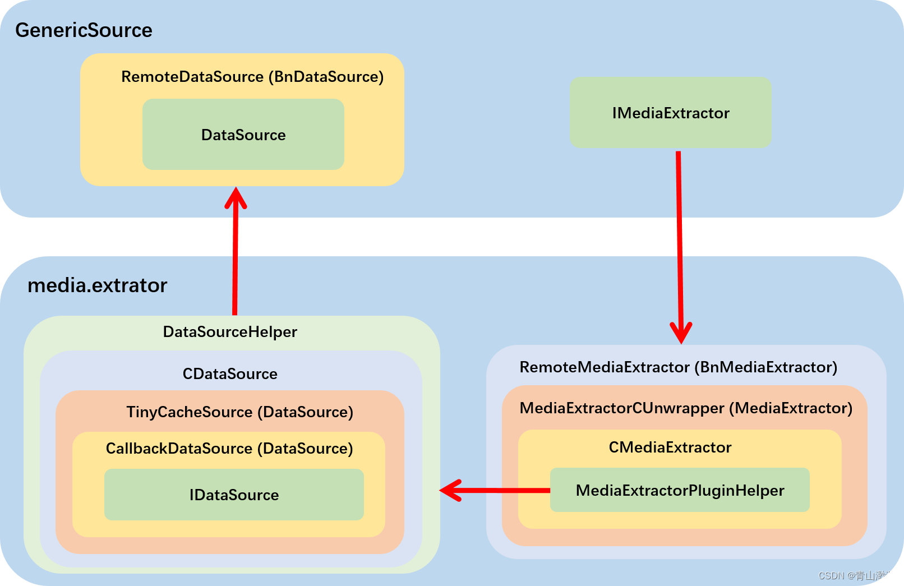

## MediaExtractor源码分析
+ media.extractor 和 media.player 是属于同一层级的 binder service，都用于提供媒体播放支持，media.player 用于提供播放器功能，而 media.extractor 主要用于本地文件播放的解封装工作。
+ media.extractor 中提供服务的主体是 MediaExtractorService ，创建 IMediaExtractor 需要借助 MediaExtractorService 的力量，这一点和 media.player 的设计是一致的，创建 IMediaPlayer 需要借助 MediaPlayerService 的力量。这两个 service 起着创建和管理实际工作实例的功能。


### MediaExtractorService
MediaExtractorService 所继承的 BnMediaExtractorService 由 aidl 文件生成，IMediaExtractorService.aidl 在 libmedia 目录下，总共有3个方法可供使用：
```java
interface IMediaExtractorService {
    IMediaExtractor makeExtractor(IDataSource source, @nullable @utf8InCpp String mime);
    IDataSource makeIDataSource(in FileDescriptor fd, long offset, long length);
    @utf8InCpp String[] getSupportedTypes();
}
```
MediaExtractorService 中到底包含哪些内容:
```java
MediaExtractorService::MediaExtractorService() {
    MediaExtractorFactory::LoadExtractors();
}
```
+ 到 /apex/com.android.media/lib/extractor /system/lib/lib /system_ext/lib 这三个目录下寻找名字中包含 extractor.so 的 lib，打开这些 lib 并用 dlsym 找到 lib 中的 GETEXTRACTORDEF 函数，最后将 libHandle，GETEXTRACTORDEF 的返回值 ExtractorDef 以及 path 封装成一个 ExtractorPlugin 存到 list 当中；
+ 遍历 ExtractorPlugin 读取 ExtractorDef 中定义的可以支持的扩展名，存储到一个列表中。

#### 设计规则
所有的 extractor 都要遵循设计规则，实现 GETEXTRACTORDEF 函数，函数的返回值是一个 ExtractorDef 对象，ExtractorDef 声明在 MediaExtractorPluginApi.h 中：
```c++
struct ExtractorDef {
    // version number of this structure
    const uint32_t def_version;

    // A unique identifier for this extractor.
    // See below for a convenience macro to create this from a string.
    media_uuid_t extractor_uuid;

    // Version number of this extractor. When two extractors with the same
    // uuid are encountered, the one with the largest version number will
    // be used.
    const uint32_t extractor_version;

    // a human readable name
    const char *extractor_name;

    union {
        struct {
            SnifferFunc sniff;
        } v2;
        struct {
            SnifferFunc sniff;
            // a NULL terminated list of container mime types and/or file extensions
            // that this extractor supports
            const char **supported_types;
        } v3;
    } u;
};
```
以下是结构体中成员的含义：
+ def_version：这个结构体的版本；
+ extractor_uuid：当前 extractor 独一无二的 id，可以使用 constUUID 方法来生成 ，使用方法查看该方法注释；
+ extractor_version：extractor 的版本，如果两个 extractor uuid 相同，那么加载时只会存储高版本的那个；
+ extractor_name：extractor 的名字，同样可以由我们自己定义；
+ u：它是一个联合体，我们只关注 v3，v3 中有一个 SnifferFunc，这就是后面选择 extractor 的依据；supported_types 表示当前 extractor 所支持的 mine type 或者 文件后缀，必须要以 NULL结尾。

#### 为什么 MediaExtractor 要以服务的形式提供呢？
+ 如果要有一个进程要使用 extractor，按照 MediaExtractorFactory 的加载方法，每个进程都要加载所有的 lib，这是很耗费时间的。放到 MediaExtractorService 一个地方加载，其他地方就都可以使用了。
+ 创建的所有的 IMediaExtractor 都可以用 MediaExtractorService 管理；
+ 如果要新增 extractor，只要按照设计规则实现，编译push到指定目录下就可以生效，不用修改加载部分的代码；

### MediaExtractorFactory

#### MediaExtractorPluginHelper
每个 extractor 都需要实现一个 MediaExtractorPluginHelper 类，这个类的作用就是封装成 MediaExtractor 对象。
```c++
// extractor plugins can derive from this class which looks remarkably
// like MediaExtractor and can be easily wrapped in the required C API
class MediaExtractorPluginHelper {
public:
  virtual ~MediaExtractorPluginHelper() {}

  /**
   *  countTracks 返回封装内的数据流，wav只有音频(1)
   */
  virtual size_t countTracks() = 0;

  /**
   * @param index 对应的track索引
   * @return MediaTrackHelper*, 返回对应Tracker的操作类
   */
  virtual MediaTrackHelper *getTrack(size_t index) = 0;

  enum GetTrackMetaDataFlags { kIncludeExtensiveMetaData = 1 };

  /***
   * getTrackMetaData 获取对应的Track的媒体信息
   * @param
   */
  virtual media_status_t getTrackMetaData(AMediaFormat *meta, size_t index,
                                          uint32_t flags = 0) = 0;

  // Return container specific meta-data. The default implementation
  // returns an empty metadata object.
  virtual media_status_t getMetaData(AMediaFormat *meta) = 0;
  virtual media_status_t setMediaCas(const uint8_t * /*casToken*/,
                                     size_t /*size*/) {
    return AMEDIA_ERROR_INVALID_OPERATION;
  }

  virtual const char *name() { return "<unspecified>"; }
  .....
};
```
##### MediaTrackHelper
MediaTrackHelper 是一个操作类，用来操作对应的 Track。
```c++
class MediaTrackHelper {
public:
    /**
   * 初始化
   */
  virtual media_status_t start() = 0;

  /**
   * 停止
   **/
  virtual media_status_t stop() = 0;
      /**
   *  获取格式信息
   * @param format 格式信息(kv结构)
   **/
  virtual media_status_t getFormat(AMediaFormat *format) = 0;

    /***
   *  read 读取数据。
   * @param buffer 读取到的数据
   * @param options 读取选项，包含seek模式、是否非阻塞等信息。
   * @return 读取状态，如果是AMEDIA_OK表示成功，其他值表示失败。
   **/
  virtual media_status_t read(MediaBufferHelper **buffer,
                              const ReadOptions *options = NULL) = 0;
  virtual bool supportsNonBlockingRead() { return false; }
 protected:
  // 转换为CMediaTrack接口
  friend CMediaTrack *wrap(MediaTrackHelper *track);
};

// CMediaTrack 是C++层的接口，用来操作对应的Track。
// 这里的data是指向MediaTrackHelper对象的指针。
struct CMediaTrack {
  void *data;
  void (*free)(void *data);

  media_status_t (*start)(void *data, CMediaBufferGroup *bufferGroup);
  media_status_t (*stop)(void *data);
  media_status_t (*getFormat)(void *data, AMediaFormat *format);
  media_status_t (*read)(void *data, CMediaBuffer **buffer, uint32_t options,
                         int64_t seekPosUs);
  bool (*supportsNonBlockingRead)(void *data);
};
```

#### 解码
+ [MediaCodec](MediaCodec.md)


#### 参考资料
+ [《MediaExtractor》](https://blog.csdn.net/qq_41828351/article/details/132482965)