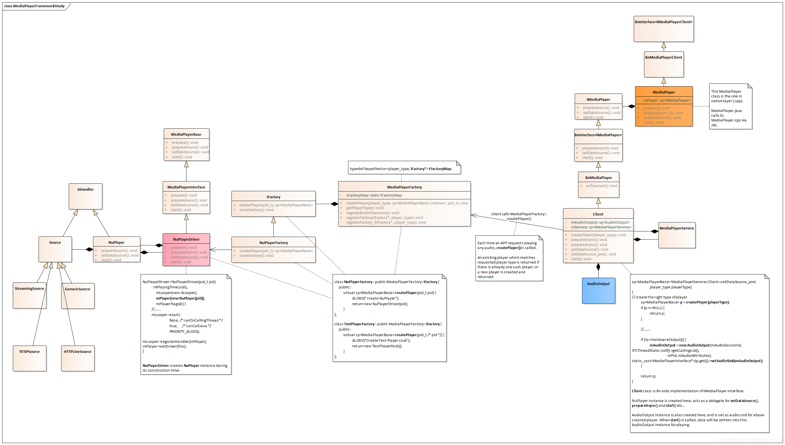

## 从 MediaPlayer 到 AudioTrack

在 Android APP 上添加音乐播放功能，使用 MediaPlayer 实现，需要调用这 3 个接口：
+ setDataSource()
+ prepare()
+ start()

当 APP 调用 Java 层的 MediaPlayer 接口时（setDataSource()、prepare()、start() 等），经过 JNI 会转入 Native 层的 MediaPlayer。这后一个 MediaPlayer，从 Frameworks 的角度来看，是处理 APP 请求的起点，也是 IMediaPlayer 的 Bp 端用户。

IMediaPlayer 的 Bn 端实现类是 MediaPlayerService::Client。具体的 player 实例（比如 NuPlayer）在 MediaPlayerService::Client 类中创建。随后，来自 APP 的调用请求（setDataSource()、prepare()、start() 等）会以 委托（delegation） 方式交由 NuPlayer 实例进行处理。

所以，Java 层只是请求的发起方、以及音频参数的来源，音频数据的读取和解码都是在 Native 层进行的。

当 APP 调用 setDataSource() 设置音频数据源时，MediaPlayerService::Client 类实例会创建出 AudioOutput 类对象，该对象随后会创建 AudioTrack 类实例用于同 AudioFlinger 之间的数据传输；NuPlayer 类实例则会根据数据类型创建相应的具体 Source 对象（比如 GenericSource、HTTPLiveSource、RTSPSource、StreamingSource）。

